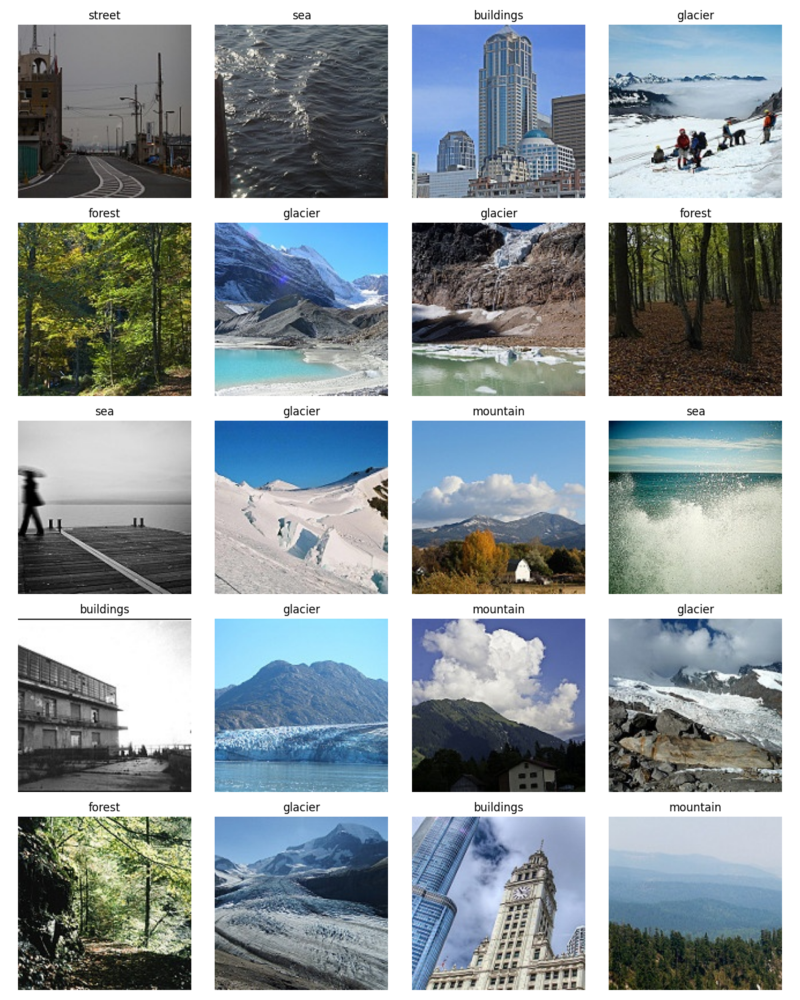
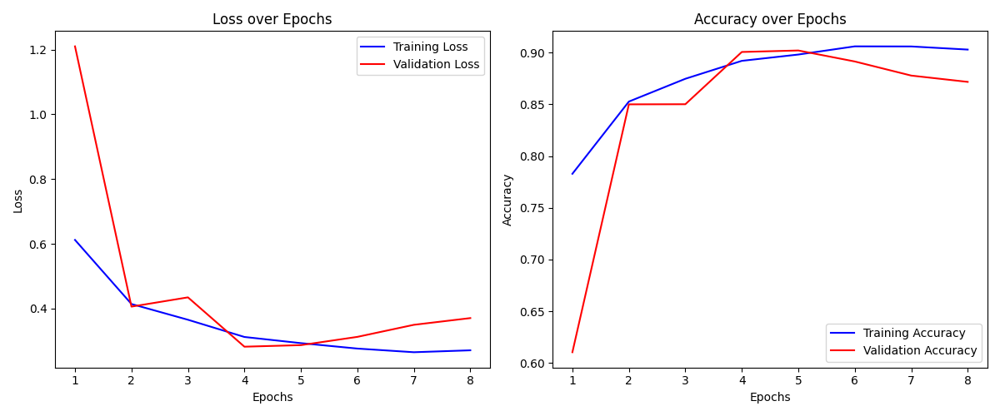

# Intel Scene Classification using ResNext101

This project focuses on classifying natural scenes and landscapes using a ResNext101 pre-trained model from the timm library. The goal is to achieve high accuracy in identifying different scene categories based on visual features.

You can also deploy this model using Streamlit. The demo can be accessed using the following link: [Intel Image Classification Demo](https://intel-image-classification-demo.streamlit.app/)

---

## 📊 Project Overview

- **Task**: Multi-class scene classification
- **Dataset**: Images belonging to 6 scene categories (buildings, forest, glacier, mountain, sea, street)
- **Model**: ResNext101 (pre-trained model from timm library)
- **Framework**: PyTorch
- **Python**: 3.10+
- **Evaluation Metrics**: Accuracy, Loss

---

## 🗂️ Dataset Samples

Below are some random samples from the dataset with corresponding labels:



---

## 📈 Training & Validation Curves

Here are the learning curves showing **Accuracy** and **Loss** over epochs:

### Train and Validation Curves


---

## 🚀 How to Run

1. Clone the repository:
   
   ```
   git clone https://github.com/akhra92/Intel-Image-Classification.git
   cd Intel-Image-Classification
   ```

2. Download the dataset from [Kaggle](https://www.kaggle.com/datasets/puneet6060/intel-image-classification) and extract it into the `dataset/Intel/` directory.

3. Install dependencies:

   ```
   pip install -r requirements.txt
   ```
   
4. Train and test the model:

   ```
   python main.py
   ```

5. Deploy locally using Streamlit:
   
   ```
   streamlit run demo.py
   ```

   You can also specify a custom checkpoint path:

   ```
   streamlit run demo.py -- -cp path/to/your/model.pth
   ```